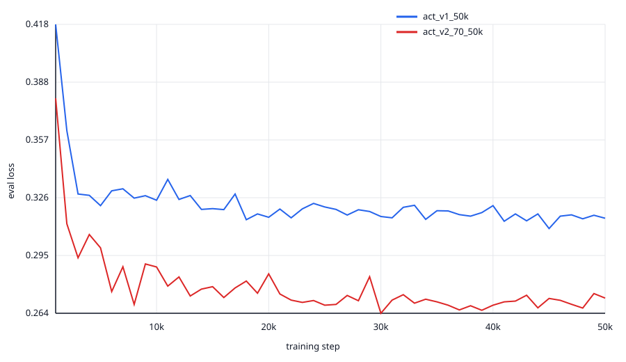
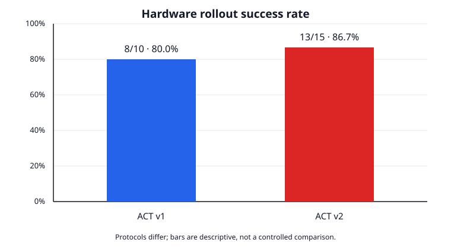

# SO-101 × LeRobot：双视角 ACT 抓取放置

这个仓库记录一套可复现的 SO-101 模仿学习闭环：硬件检查、双摄像头采集、ACT 训练、实机 rollout、失败分析和针对性补数。当前公开阶段覆盖 ACT v1 与 ACT v2。

任务描述：`Pick up the fixed yellow cable bundle and place it in the black target area.`

## 结果摘要

| 版本 | 训练数据 | 最佳 checkpoint | 最佳 eval loss | 部署参数 | 实机结果 |
|---|---:|---:|---:|---|---:|
| ACT v1 | 50 episodes / 16,881 frames | 45k | 0.3095 | `n_action_steps=100` | 8/10（80%） |
| ACT v2 | 70 episodes / 23,868 frames | 30k | 0.2643 | `n_action_steps=50` | 13/15（86.7%） |

v1 与 v2 的验证集和实机评测协议不同，上表不能作为严格的横向性能证明。它记录的是两个阶段各自的观察结果；详见 [v1 结果](docs/act_v1_results.md) 与 [v2 结果](docs/act_v2_results.md)。





## 硬件与软件

- SO-101 Leader + Follower，Feetech STS3215，6 DoF
- 手眼相机 + 第三视角相机，640×480
- Ubuntu、Python 3.12、CUDA GPU
- LeRobot `v0.6.1`，固定 commit `7e241bd630a3719a56157a497ce5d08f244784f1`
- ACT，ResNet-18 双视角输入，动作维度 6

## 快速开始

```bash
git clone --recurse-submodules https://github.com/li-clone/so101-lerobot-project.git
cd so101-lerobot-project
git submodule update --init --recursive
test "$(git -C upstream/lerobot rev-parse HEAD)" = \
  "7e241bd630a3719a56157a497ce5d08f244784f1"

cp configs/hardware_ports.example.yaml configs/hardware_ports.local.yaml
```

然后按本机设备修改 `hardware_ports.local.yaml`。不要把本地端口、校准文件或凭据提交到 Git。

## 文档导航

- [环境与硬件](docs/hardware_setup.md)
- [机械臂标定](docs/calibration.md)
- [双摄像头配置](docs/camera_setup.md)
- [数据采集](docs/data_collection.md)
- [ACT 训练](docs/training.md)
- [Rollout 与安全](docs/rollout_and_safety.md)
- [故障排查](docs/troubleshooting.md)
- [数据与模型上传清单](docs/artifact_upload.md)
- [公开视频处理](media/README.md)

## 安全警告

实机推理前清空工作区，准备急停或断电手段，先用短时 rollout 验证方向和初始姿态。异常退出后必须检查 `Torque_Enable`；默认断连失败时使用：

```bash
python scripts/safety/safe_disable_follower_torque.py \
  --port /dev/serial/by-id/<FOLLOWER_SERIAL_DEVICE>
```

若脚本无法确认全部关扭矩，立即切断 Follower 12 V 电源。不要手动强扭仍处于使能状态的关节。

## 数据与许可证

GitHub 只保存代码、小型摘要、校验清单和脱敏媒体，不包含原始数据、模型权重、完整日志、校准文件或厂商 PDF。数据与模型的建议存放方式见 [artifact_upload.md](docs/artifact_upload.md)。本仓库自有代码使用 [MIT License](LICENSE)；LeRobot、厂商资料和其他第三方内容仍适用各自许可证。
